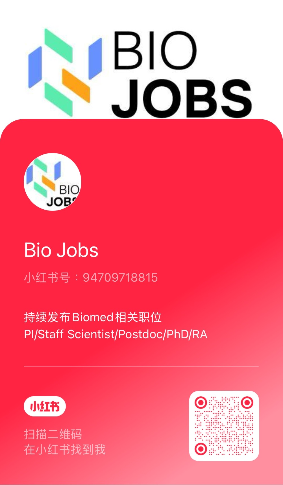

# Bio Jobs

A curated list of opportunities in biology/medicine/bioinformatics, including academic positions, industry roles, and career development resources.

## Table of Contents 📑
- [Job Postings](#job-postings)
  - [Team Leader/PI](#team-leaderpi)
  - [Staff Scientist](#staff-scientist)
  - [Postdoc](#postdoc)
  - [PhD](#phd)
  - [RA/Internship](#rainternship)
  - [Others](#others)
- [Career Seminars](#career-seminars)

---

## Job Postings

### Team Leader/PI
**Team Leaders and Principal Investigators**

🌎 North America

- 🇺🇸 [Arc Institute Core Investigator](https://arcinstitute.org/programs/core-investigators)  
- 🇨🇦 [PI in Biomedical Discovery Research, The Lunenfeld-Tanenbaum Research Institute (LTRI) of Sinai Health, University of Toronto](https://apply.interfolio.com/152420)  
- 🇨🇦 [PI positions in Population Health Data Science, The Lunenfeld-Tanenbaum Research Institute (LTRI) of Sinai Health, University of Toronto](https://apply.interfolio.com/152361)  
- 🇺🇸 [University of Utah Department of Human Genetics Open Search for Tenure-Track Faculty](https://utah.peopleadmin.com/postings/170913)  
- 🇺🇸 [Computational Genomics (together with Department of Bioinformatics)](https://utah.peopleadmin.com/postings/170449)  
- 🇺🇸 [Group leader in development of Instrumented Tissues and their application to inflammation and immunity, Chan Zuckerberg Biohub Chicago](https://job-boards.greenhouse.io/czbiohubchicago/jobs/4219891005)  
- 🇺🇸 [Tenure-track Assistant Professor in Bioengineering, UCLA](https://recruit.apo.ucla.edu/JPF09613)  
- 🇺🇸 [Faculty in virology, Northwestern Northwestern University Feinberg School of Medicine](https://jobs.sciencecareers.org/job/660580/faculty-position-in-virology/?TrackID=364650&utm_source=jobs&utm_medium=email&utm_campaign=email-careers-job-alert&BatchID=6165&JobAlertId=418793)  
- 🇺🇸 [Associate/Assistant Professor, Department of Biochemistry and Molecular Biology (BIO), Uniformed Services University of the Health Sciences](https://www.higheredjobs.com/details.cfm?JobCode=178874746)  
- 🇺🇸 [Faculty position at NIH](https://irp.nih.gov/careers/faculty-level-scientific-careers/stadtman-investigator-search-2024-2025)  
- 🇺🇸 [Neuroscience Faculty Position, St. Jude Children's Research Hospital](https://www.nature.com/naturecareers/job/12821303/neuroscience-faculty-position/?TrackID=29551&BatchID=527&JobAlertId=38023&cmpid=JBE_TL_20240809_jobtitle&utm_source=jbe&utm_medium=email&utm_campaign=JBE_TL_20240809_applynow_job2)  
- 🇺🇸 [UMass Biochem & Mol Biotech faculty](https://jobs.sciencecareers.org/job/659798/tenured-or-tenure-track-faculty-position/?TrackID=364650&BatchID=6140&JobAlertId=418793&cmpid=JBE_TL_20240801_jobtitle&utm_source=jbe&utm_medium=email&utm_campaign=JBE_TL_20240801_jobtitle_job3)  
- 🇺🇸 [UPenn Assistant Professor in Microbiology](https://jobs.sciencecareers.org/job/659879/faculty-positions-in-the-department-of-microbiology-assistant-rank/?TrackID=364650&BatchID=6140&JobAlertId=418793&cmpid=JBE_TL_20240801_jobtitle&utm_source=jbe&utm_medium=email&utm_campaign=JBE_TL_20240801_jobtitle_job2)  
- 🇺🇸 [Stanford Chemistry Assistant Professor](https://jobs.sciencecareers.org/job/659914/assistant-professor-in-chemistry-open-area-/?TrackID=364650&BatchID=6141&JobAlertId=418793&cmpid=JBE_TL_20240802_jobtitle&utm_source=jbe&utm_medium=email&utm_campaign=JBE_TL_20240802_jobtitle_job5)  
- 🇺🇸 [NYU Assistant/associate professor The Department of Biochemistry and Molecular Pharmacology](https://www.nature.com/naturecareers/job/12821162/assistant-associate-professor-new-york-university-grossman-school-of-medicine/?TrackID=29551&BatchID=522&JobAlertId=38023&cmpid=JBE_TL_20240804_jobtitle&utm_source=jbe&utm_medium=email&utm_campaign=JBE_TL_20240804_jobtitle_job2)  
- 🇺🇸 [UNC Faculty Open Rank The Department of Cell Biology & Physiology and the Neuroscience Center](https://jobs.sciencecareers.org/job/659916/open-rank/?TrackID=364650&BatchID=6142&JobAlertId=418793&cmpid=JBE_TL_20240803_jobtitle&utm_source=jbe&utm_medium=email&utm_campaign=JBE_TL_20240803_jobtitle_job2)  
- 🇺🇸 [Princeton faculty open rank in biological, chemical, physical, engineering and/or computational](https://www.nature.com/naturecareers/job/12821206/assistant-associate-or-full-professor-princeton-university/?TrackID=29551&BatchID=524&JobAlertId=38023&cmpid=JBE_TL_20240806_jobtitle&utm_source=jbe&utm_medium=email&utm_campaign=JBE_TL_20240806_jobtitle_job3)  
- 🇺🇸 [Assistant Professor - Human Evolutionary Biology - Integrative Biology, University of California, Berkeley](https://jobs.sciencecareers.org/job/659773/assistant-professor-human-evolutionary-biology-integrative-biology/?TrackID=364650&BatchID=6138&JobAlertId=418793&cmpid=JBE_TL_20240730_jobtitle&utm_source=jbe&utm_medium=email&utm_campaign=JBE_TL_20240730_jobtitle_job5)  
- 🇺🇸 [Biochemistry Faculty, Department of Biochemistry - Tenure Track, The UT Southwestern Medical Center](https://jobs.sciencecareers.org/job/659792/biochemistry-faculty-department-of-biochemistry-tenure-track/?TrackID=364650&BatchID=6138&JobAlertId=418793&cmpid=JBE_TL_20240730_jobtitle&utm_source=jbe&utm_medium=email&utm_campaign=JBE_TL_20240730_jobtitle_job2)  
- 🇺🇸 [Michigan Ann Arbor Assistant Professor: Molecular, Cellular & Developmental Biology](https://apply.interfolio.com/149762)    

🌎 Europe

- 🇨🇭 [Assistant professor in AI-oriented Computational Biology | Department of Computational Biology, University of Lausanne (UNIL)](https://career5.successfactors.eu/career?career%5fns=job%5flisting&company=universitdP&navBarLevel=JOB%5fSEARCH&rcm%5fsite%5flocale=fr%5fFR&career_job_req_id=22212&selected_lang=fr_FR&jobAlertController_jobAlertId=&jobAlertController_jobAlertName=&browserTimeZone=Europe/Zurich&_s.crb=wOHdnQ6kHT4w3w7tDfxMLsCeIfAJq%2f35KHss2OhCupw%3d)
- 🇸🇪 [Assistant professor in Vivo-mimetic Technology | KTH Royal Institute of Technology, School of Engineering Sciences](https://www.kth.se/lediga-jobb/795970?l=en)
- 🏴󠁧󠁢󠁥󠁮󠁧󠁿 [Group Leader in Generative and Synthetic Genomics | Sanger Institute](https://sanger.wd103.myworkdayjobs.com/en-US/WellcomeSangerInstitute/job/Hinxton-Cambridgeshire/Group-Leader---Generative-and-Synthetic-Genomics_JR102799)
- 🏴󠁧󠁢󠁥󠁮󠁧󠁿 [Protein Function Content Team Leader | EMBL-EBI](https://embl.wd103.myworkdayjobs.com/en-US/EMBL/job/Protein-Function-Content-Team-Leader_JR343)
- 🇨🇭 [Scientific Junior Group Leaders, Institute of Human Biology (IHB)](https://institutehumanbiology.com/about-the-ihb/careers/scientific-junior-group-leaders/)  
- 🇳🇱 [Tenure-track Principal Investigator position – Hubrecht Institute – Utrecht](https://www.hubrecht.eu/job/tenure-track-principal-investigator-position-hubrecht-institute-utrecht/)  
- 🇬🇧 [Lecturer in developmental, cell or stem cell biology, King's College London](https://my.corehr.com/pls/coreportal_kclp/erq_jobspec_version_4.display_form?p_company=1&p_internal_external=E&p_display_in_irish=N&p_process_type=&p_applicant_no=&p_form_profile_detail=&p_display_apply_ind=Y&p_refresh_search=Y&p_recruitment_id=095025)  
- 🇬🇧 [Two Group Leaders in human developmental biology, Cambridge University Gurdon Institute](https://www.jobs.cam.ac.uk/job/47789/)  
- 🇬🇧 [Group Leader in Stem Cell Science, Cambridge University](https://www.jobs.cam.ac.uk/job/48231/)  
- 🇸🇪 [Group Leader, Karolinska Institutet](https://ki.varbi.com/en/what:job/jobID:741513/type:job/where:4/apply:1)  
- 🇨🇭 [Assistant professor for SNSF Starting Grant in Biochemistry, University of Zurich](https://jobs.uzh.ch/job-vacancies/assistant-professor-for-snsf-starting-grant-in-biochemistry/0d4d925e-5720-486c-bd97-00b26d7d6f32)

🌎 Asia

- 🇨🇳 [国家生物信息中心招聘](https://mp.weixin.qq.com/s/ZptulehQ19ADe1_5goiNkw)  
- 🇨🇳 [中国科学院杭州医学研究所诚招PI](./files/中科院杭州医学.pdf)  
- 🇨🇳 [深圳大学青年科学家论坛](./files/深圳大学.jpeg)  
- 🇨🇳 [复旦大学药学院UCSF招聘宣讲会](https://mp.weixin.qq.com/s/U_cx9ELW2oUID6ndEVlaaA)  
- 🇨🇳 [上交全球健康学院诚招PI](./files/上交全球健康学院.jpg)  
- 🇭🇰 [Associate Professor / Assistant Professor in Medical Laboratory Science, The Hong Kong Polytechnic University](https://www.nature.com/naturecareers/job/12820674/associate-professor-assistant-professor-in-medical-laboratory-science/?TrackID=29551&BatchID=512&JobAlertId=38023&cmpid=JBE_TL_20240725_jobtitle&utm_source=jbe&utm_medium=email&utm_campaign=JBE_TL_20240725_jobtitle_job2)  
- 🇸🇬 [Nanyang Assistant/Associate Professorship (NAP), Nanyang Technological University (NTU)](https://www.nature.com/naturecareers/job/12820900/nanyang-assistant-associate-professorship-nap-/?TrackID=29551&BatchID=518&JobAlertId=38023&cmpid=JBE_TL_20240731_jobtitle&utm_source=jbe&utm_medium=email&utm_campaign=JBE_TL_20240731_jobtitle_job1) 

<!-- 

🌎 Oceania

 -->

### Staff Scientist
**Research positions in Academia or Industry**

🌎 North America

- 🇺🇸 [Principal Scientist, Biophysical Characterization at Merck](https://jobs.merck.com/us/en/job/R313622/Principal-Scientist-Biophysical-Characterization)  
- 🇺🇸 [AI/ML Engineers, AI/ML Phenomics Team at GSK](https://gsk.wd5.myworkdayjobs.com/GSKCareers/job/USA---California---San-Francisco/AI-ML-Engineer_405239)  
- 🇺🇸 [Staff Scientist (Research Lab Specialist Senior) at the University of Michigan Medical School](https://careers.umich.edu/job_detail/254332/research-lab-specialist-senior-brcf-proteomics-resource-facility)  
- 🇺🇸 [RNA Technology Scientist, Verve Therapeutics](https://www.linkedin.com/jobs/view/3977998423/)  
- 🇺🇸 [Senior Computational Biologist, Merck Sharp & Dohme](https://msd.wd5.myworkdayjobs.com/SearchJobs/job/USA---Massachusetts---Cambridge-320-Bent-Street/Senior-Computational-Biologist_R303307-1)  
- 🇺🇸 [Research Associate I-III Services, Active Motif](https://activemotif.isolvedhire.com/jobs/1117173.html)  
- 🇺🇸 [Bioinformatics Scientist, Active Motif](https://activemotif.isolvedhire.com/jobs/1183311.html)  
- 🇺🇸 [Computational Cancer Biologist, Shennon Biotechnologies](https://boards.greenhouse.io/shennonbiotechnologies/jobs/4067332007)  
- 🇺🇸 [Research Associate/Data Analyst, Department of Oral Health Policy and Epidemiology (OHPE) at the Harvard School of Dental Medicine (HSDM)](https://academicpositions.harvard.edu/postings/13757)  
- 🇺🇸 [UCLA Academic Administrator III Associate Director of Computational Biology and Neuroscience Programs](https://jobs.sciencecareers.org/job/658614/academic-administrator-iii-associate-director-of-computational-biology-and-neuroscience-programs/?TrackID=364650&BatchID=6085&JobAlertId=418793&cmpid=JBE_TL_20240606_jobtitle&utm_source=jbe&utm_medium=email&utm_campaign=JBE_TL_20240606_applynow_job1)  

🌎 Europe

- 🇬🇧 [Cambridge University Senior Research Technician](https://www.jobs.cam.ac.uk/job/48353/)  
- 🇬🇧 [Senior Scientist with experience in immunology, GSK](https://jobs.gsk.com/en-gb/jobs/404547?lang=en-us&previousLocale=en-GB)  
- 🇬🇧 [Principal Laboratory Research Scientist, Francis Crick Institute](https://www.crick.ac.uk/careers-study/vacancies/2024-09-02-principal-laboratory-research-scientist)  
- 🇬🇧 [Scientist II – Project Immunology (Full Time - Permanent), Mestag Therapeutics](./FT%20Permanent%20JD%20Scientist%20II%20Immunology-%20Final.pdf)  
- 🇬🇧 [Research Assistant/Research Associate, Department of Pathology at University of Cambridge](./ResearchAssistant_ResearchAssociate_Aug2024_v3.pdf)  
- 🇬🇧 [Senior Research Associates - Bioinformatician Team, Institute of Metabolic Science – Metabolic Research Laboratories (IMS-MRL) at University of Cambridge](https://www.nature.com/naturecareers/job/12820129/senior-research-associates-x-3-bioinformatician-team/)  
- 🇬🇧 [Senior Bioinformatician, Wellcome Sanger Institute](https://www.linkedin.com/posts/open-targets_were-recruiting-activity-7206962029331365889-iTvG/?utm_source=share&utm_medium=member_ios)  
- 🇬🇧 [Scientist II Immunology, Mestag Therapeutics](https://www.linkedin.com/jobs/view/3966557275/?alternateChannel=search&refId=UrF1Y1LCuZ4P5LrtqpcGwg%3D%3D&trackingId=cChmwhg%2FSB7G3QMAIDbP%2FQ%3D%3D)  
- 🇬🇧 [Bioinformatician (Fixed Term), Milner Therapeutics Institute (MTI) at University of Cambridge](https://www.jobs.cam.ac.uk/job/47209/)  
- 🇬🇧 [Senior Research Associate (Single Cell/Transcriptomics Senior Bioinformatician), Cambridge University Institute of Metabolic Science – Metabolic Research Laboratories (IMS-MRL)](https://www.nature.com/naturecareers/job/12819739/senior-research-associate-single-cell-transcriptomics-senior-bioinformatician-/?TrackID=29551&BatchID=488&JobAlertId=38023&cmpid=JBE_TL_20240701_jobtitle&utm_source=jbe&utm_medium=email&utm_campaign=JBE_TL_20240701_jobtitle_job1)  
- 🇬🇧 [Lecturer in Metabolic Biochemistry, University of Reading](https://www.jobs.ac.uk/job/DIC416/lecturer-in-metabolic-biochemistry)  
- 🇬🇧 [Departmental Lecturer in Engineering Biology (Control Engineering), University of Oxford - Department of Engineering Science](https://www.jobs.ac.uk/job/DIC940/departmental-lecturer-in-engineering-biology-control-engineering)  
- 🇫🇷 [INSERM - U1312 BRIC Call for applications- junior and senior scientists](https://www.nature.com/naturecareers/job/12818576/call-for-applications-junior-and-senior-scientists/?TrackID=29551&BatchID=456&JobAlertId=38023&cmpid=JBE_TL_20240529_jobtitle&utm_source=jbe&utm_medium=email&utm_campaign=JBE_TL_20240529_applynow_job1)  
- 🇩🇪 [Max Planck Institute for Biology of Ageing (MPIAGE) Bioinformatician (m/f/div)](https://www.nature.com/naturecareers/job/12818607/bioinformatician-m-f-div-/?TrackID=29551&BatchID=457&JobAlertId=38023&cmpid=JBE_TL_20240530_jobtitle&utm_source=jbe&utm_medium=email&utm_campaign=JBE_TL_20240530_applynow_job2)  

🌎 Asia

- 🇨🇳 [浙大医学院附属第一医院苏殿三课题组](https://mp.weixin.qq.com/s/F8Qz9xRCS-dgaZxvtMh6VQ)  
- 🇨🇳 [Data Scientist | 百济神州 | 从文献、新闻、patent里挖药物靶点](https://app.mokahr.com/recommendation-recruitment/beigene/98936?recommendCode=NTA1Myk&single=true#/job/bece1a2d-7c69-4d1f-93cd-4e5b78c0819b)  

<!-- 

🌎 Oceania

 -->

### Postdoc
**Postdoctoral positions and fellowships**

🌎 North America

- 🇺🇸 [Michigan Innovation and Entrepreneurship Fellowship](https://biointerfaces.umich.edu/fellowship/)
- 🇺🇸 [Postdoc, Grad student at Wu Tsai Neurosciences Institute, Stanford University](./fanglab.jpg)  
- 🇺🇸 [Postdoctoral at Stanford Medicine focusing on tumor-infiltrating lymphocyte (TIL) therapies for melanoma](https://postdocs.stanford.edu/prospective/opportunities/open-postdoctoral-position-faculty-mentor-allison-betof-warner)  
- 🇺🇸 [Postdoctoral Positions in Biomicrofluidics & Spatial Transcriptomics, Chemistry & Institute for Genomic Biology, University of Illinois](https://hanlab.scs.illinois.edu/1615-2/)  
- 🇺🇸 [MD Anderson TRIUMPH postdoc fellowship](https://www.mdanderson.org/education-training/research-training/postdoctoral-training/postdoctoral-fellowships/cprit-triumph-program.html)  
- 🇺🇸 [Postdoctoral researchers in AI Modeling and Earth System Science, Digital Agricultural Group at the University of Minnesota – Twin Cities](https://umn-digitalag.com/join-us/)  
- 🇺🇸 [Postdoctoral in Computational Biology, Broad Institute of Harvard and MIT](https://docs.google.com/document/d/1R5kSSUX4A3x0CZYsTUdUtxPJYHRwZ04SIl5G06_MrlQ/preview)  
- 🇺🇸 [Postdoctoral Research Fellow Position in Bacterial Pathogenesis](https://www.uth.edu/postdocs/open-postdoc-positions.htm#d8935ee4-b008-4d84-aef5-457cd5d0b301)  
- 🇺🇸 [Postdoc in High-Dimensional Statistics/Computational Biology, Harvard T.H. Chan School of Public Health](https://academicpositions.harvard.edu/postings/13972)  
- 🇺🇸 [Multiple Postdoctoral Research Fellows and Research Associates in the areas of foundation AI, Harvard Medical School](https://zitniklab.hms.harvard.edu/jobs/)  
- 🇺🇸 [Postdoc in Biostatistics and Epidemiology – Center for Tuberculosis Institute for Global Health Sciences (IGHS), UC San Francisco](./Center%20for%20TB%20Postdoc.pdf)  
- 🇺🇸 [Postdoc position in systems biology, Chan Zuckerberg Biohub Chicago](./CZ_Postdoc_Son_v4.pdf)  
- 🇺🇸 [✨UCSF postdoc in single-cell and organoid perturbations✨](https://opportunities.ucsf.edu/content/open-postdoctoral-position-human-organoids-and-single-cell-multiomics-university-california)  
- 🇺🇸 [✨UCSF postdoc in single-cell and spatial data analysis✨](https://opportunities.ucsf.edu/content/open-postdoctoral-position-computational-analyses-single-cell-multiomic-and-spatial-data)  
- 🇺🇸 [Postdoc, Qing Yi group, Weill Cornell Medicine](Qing_Yi_postdoc.pdf)  
- 🇺🇸 [Research Fellow in Machine Learning and Protein Design, Biogen, Cambridge, MA](https://www.linkedin.com/jobs/view/3973364853/)  
- 🇺🇸 [Novartis Data Science Innovation Postdoctoral Fellow: Cardiac AI](https://novartis.wd3.myworkdayjobs.com/es/Novartis_Careers/job/Cambridge-USA/Data-Science-Innovation-Postdoctoral-Fellow--Cardiac-AI_REQ-10014140)  
- 🇺🇸 [Post Doctoral Researcher, Data Science – Artificial Intelligence for Computer Vision, Johnson & Johnson Innovative Medicine (J&J IM)](https://jobs.jnj.com/en/jobs/2406195057w/post-doctoral-researcher-data-science-artificial-intelligence-for-computer-vision/)  
- 🇨🇦 [Postdoctoral Research Program (PRP), Natural Resources Canada](https://nrcan-rncan.hiringplatform.ca/processes/6355-postdoctoral-research-program-prp?locale=en)  

🌎 Europe

- 🏴󠁧󠁢󠁥󠁮󠁧󠁿 [Novo Nordisk Postdoctoral Research Fellow | Radcliffe Department of Medicine, University of Oxford](https://my.corehr.com/pls/uoxrecruit/erq_jobspec_version_4.display_form?p_company=10&p_internal_external=E&p_display_in_irish=N&p_process_type=&p_applicant_no=&p_form_profile_detail=&p_display_apply_ind=Y&p_refresh_search=Y&p_recruitment_id=178554)
- 🏴󠁧󠁢󠁳󠁣󠁴󠁿[Postdoctoral Research Fellow in Pathogen Genomics | Professor Deborah Williamson and Professor Matt Holden | School of Medicine, University of St Andrews](https://www.jobs.ac.uk/job/DMR693/research-fellow-ar3117sb)
- 🇬🇧[Postdoctoral Fellow in early detection, cancer genomics and long-read sequencing data analysis | Cortes-Ciriano group | EMBL-EBI](https://embl.wd103.myworkdayjobs.com/en-US/EMBL/job/Postdoctoral-Fellow_JR351)
- 🇬🇧 [ARISE2 - MSCA-funded postdoctoral fellowship programme at EMBL](https://www.embl.org/training/arise2/)  
- 🇬🇧 [Postdoctoral Fellow - In situ structural biology, AZ Cambridge](https://careers.astrazeneca.com/job/cambridge/postdoctoral-fellow-in-situ-structural-biology-of-sarm1/7684/69550666720)  
- 🇬🇧 [UCL Research Assistant / Research Fellow in Neuroembryology](https://www.ucl.ac.uk/work-at-ucl/search-ucl-jobs/details?nPostingId=9940&nPostingTargetId=25580&id=Q1KFK026203F3VBQBLO8M8M07&LG=UK&languageSelect=UK&mask=ext)  
- 🇬🇧 [Research Associate in Engineering Biology for Magnetic Control, The University of Edinburgh](https://www.jobs.ac.uk/job/DIW367/research-associate-in-engineering-biology-for-magnetic-control)  
- 🇬🇧 [Research Fellow/Associate, Imperial College London, Bezos Centre for Sustainable Protein](https://www.jobs.ac.uk/job/DIW113/research-fellow-associate)  
- 🇬🇧 [Senior Postdoctoral Scientist for Synthetic Biologics, Rosalind Franklin Institute](https://www.jobs.ac.uk/job/DIM824/senior-postdoctoral-scientist-for-synthetic-biologics-10334)  
- 🇩🇰 [Fully funded Postdoc position in Neurobiology, Aarhus University](https://www.nature.com/naturecareers/job/12819840/fully-funded-postdoc-position-in-neurobiology/)  
- 🇩🇪 [Postdoctoral Fellow, Systems Genetics and Precision Health, EMBL Heidelberg](https://www.embl.org/jobs/position/HD02665)  
- 🇫🇷 [Postdoctoral Opportunity in Protein Function Prediction at Sorbonne Université](./Postdoctoral%20Opportunity%20in%20Protein%20Function%20Prediction%20at%20Sorbonne%20Université.pdf)  
- 🇫🇷 [Postdoctoral Organic/Medicinal Chemist at EMBL Grenoble](https://www.embl.org/jobs/position/GR00232)  
- 🇨🇭 [Data Science Innovation Fellow](https://www.novartis.com/careers/career-search/job/details/req-10013704-data-science-innovation-fellow)  
- 🏴󠁧󠁢󠁳󠁣󠁴󠁿 [Postdoctoral Research Scientist - Tumour Microenvironment and Cancer Metabolism, CRUK Scotland Institute](https://www.jobs.ac.uk/job/DJN000/postdoctoral-research-scientist-tumour-microenvironment-and-cancer-metabolism?uuid=21acce29-6997-11ef-aadc-027e9b1da9c1&campaign=jbe20240903&source=jbe)  
- 🏴󠁧󠁢󠁥󠁮󠁧󠁿 [EMBL-EBI/Sanger postdoctoral fellowship (ESPOD)](https://www.ebi.ac.uk/research/postdocs/espods)  

🌎 Asia

- 🇨🇳 [上交全球健康学院诚招博士后](上交全球健康学院.jpg)  
- 🇸🇬 [Research Fellow / Clinical Research Fellow in Myopia, National University of Singapore](https://www.mycareersfuture.gov.sg/job/sciences/research-fellow-national-university-singapore-bc3fcc769e0ff77c5a7eead7373c7cf8?source=MCF&event=Search)  
- 🇸🇬 [Research Fellow in Visual Neurosciences, National University of Singapore](https://www.mycareersfuture.gov.sg/job/sciences/research-fellow-national-university-singapore-0cf0fb27e1631f1bcbdd11eade3a6bfd?source=MCF&event=Search)  
- 🇭🇰 [AI for Computational Biology Postdoc, Department of Computer Science at University of Hong Kong](https://mp.weixin.qq.com/s/CjCxol6_q5KwSECZUr_p8Q)  

<!-- 

🌎 Oceania

 -->

### PhD
**PhD studentships and graduate programs**
<!-- 

🌎 North America

🌎 Europe

🌎 Asia

🌎 Oceania

 -->

### RA/Internship
**Research assistant and internship opportunities**
<!-- 

🌎 North America

 -->

🌎 Europe

🇩🇪🇬🇧🇫🇷🇪🇸🇮🇹[EMBL TechDev Internship Programme](https://embl.wd103.myworkdayjobs.com/en-US/EMBL/job/EMBL-TechDev-Internships_JR1401)

<!-- 

🌎 Asia

 -->

<!-- 

🌎 Oceania

 -->

### Others
**Miscellaneous opportunities**

🌎 North America

🇺🇸[Associate or Senior Editor | Nature Genetics and Nature Communication](https://www.nature.com/naturecareers/job/12838754/associate-or-senior-editor-nature-genetics-and-nature-communication/?TrackID=27704&BatchID=773&JobAlertId=35682&cmpid=JBE_TL_20250412_jobtitle&utm_source=jbe&utm_medium=email&utm_campaign=JBE_TL_20250412_jobtitle_job1)

<!-- 

🌎 Europe

 -->

<!-- 

🌎 Asia

 -->

<!-- 

🌎 Oceania

 -->

---

## Career Seminars
**Upcoming virtual/in-person events**

---

## RedNote 小红书号

---

📧 **Contact**: [biojobs25@gmail.com](mailto:biojobs25@gmail.com)